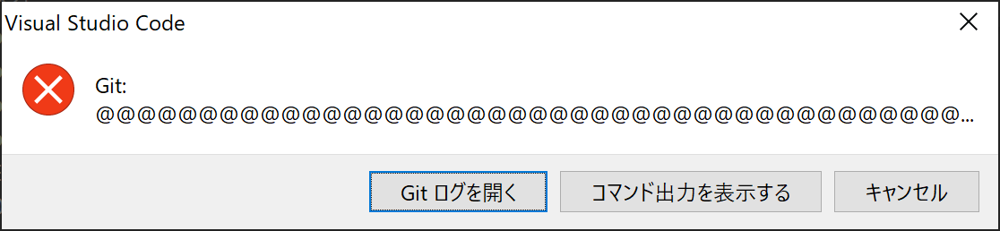

このブログを作って記事をアップロードしようとしたら、謎のウィンドウが出てきてびっくりした。



@が多すぎてよくわからない…
普段、作業はVSCodeでやっていてGitもGUIで楽しています。

GitHubのログが出ていたので確認したら、ログの１行目が出ているだけだったっぽい。

```
@@@@@@@@@@@@@@@@@@@@@@@@@@@@@@@@@@@@@@@@@@@@@@@@@@@@@@@@@@@
@    WARNING: REMOTE HOST IDENTIFICATION HAS CHANGED!     @
@@@@@@@@@@@@@@@@@@@@@@@@@@@@@@@@@@@@@@@@@@@@@@@@@@@@@@@@@@@
IT IS POSSIBLE THAT SOMEONE IS DOING SOMETHING NASTY!
Someone could be eavesdropping on you right now (man-in-the-middle attack)!
It is also possible that a host key has just been changed.
The fingerprint for the RSA key sent by the remote host is
SHA256:XXXXXXXXXXXXXXXXXXXXXXXXXXXXXXXXXXXXX.
Please contact your system administrator.
Add correct host key in /home/mutax/.ssh/known_hosts to get rid of this message.
Offending RSA key in /home/mutax/.ssh/known_hosts:1
  remove with:
  ssh-keygen -f "/home/mutax/.ssh/known_hosts" -R "github.com"
RSA host key for github.com has changed and you have requested strict checking.
Host key verification failed.
fatal: Could not read from remote repository.

Please make sure you have the correct access rights
and the repository exists.
```

結論として、github.comのRSAホストキーが変わった？ということらしい。

pushできないのは困るのでGitのログに従って、known_hostsを追加した。
```bash
ssh-keygen -f "/home/mutax/.ssh/known_hosts" -R "github.com"
```

それだけだと反映されなかったのでsshで接続テストした。
途中「fingerprintあっているか？」みたいなことを聞いてくるので、GitHubのホームページで確認し、yes。
GitHubのフィンガープリントは[ここ](https://docs.github.com/ja/authentication/keeping-your-account-and-data-secure/githubs-ssh-key-fingerprints)で確認できる。
```bash
$ ssh -T git@github.com
The authenticity of host 'github.com (20.27.177.113)' can't be established.
ECDSA key fingerprint is SHA256:p2QAMXNIC1TJYWeIOttrVc98/R1BUFWu3/LiyKgUfQM.
Are you sure you want to continue connecting (yes/no/[fingerprint])? yes
Warning: Permanently added 'github.com' (ECDSA) to the list of known hosts.
Warning: the ECDSA host key for 'github.com' differs from the key for the IP address '20.27.177.113'
Offending key for IP in /home/mutax/.ssh/known_hosts:3
Are you sure you want to continue connecting (yes/no)? yes
Enter passphrase for key '/home/mutax/.ssh/id_rsa':
Hi r-mutax! You've successfully authenticated, but GitHub does not provide shell access.
```

追加できたっぽいので満を持して`git push`した。

```bash
$ git push
Warning: the ECDSA host key for 'github.com' differs from the key for the IP address '20.27.177.113'
Offending key for IP in /home/mutax/.ssh/known_hosts:3
Matching host key in /home/mutax/.ssh/known_hosts:4
Are you sure you want to continue connecting (yes/no)? yes
Enter passphrase for key '/home/mutax/.ssh/id_rsa':
Enumerating objects: 11, done.
Counting objects: 100% (11/11), done.
Delta compression using up to 8 threads
Compressing objects: 100% (4/4), done.
Writing objects: 100% (6/6), 826 bytes | 37.00 KiB/s, done.
Total 6 (delta 1), reused 0 (delta 0)
remote: Resolving deltas: 100% (1/1), completed with 1 local object.
To github.com:r-mutax/blog.git
   934eb45..45c3bd9  main -> main
```

*このあたりから記憶が曖昧だけど*、pushできたっぽいけど「パスフレーズは？」とか聞かれる。
毎回聞かれるのは面倒だなと思って調べたら、ssh-agentにGitHubを登録するといいらしい。

```bash
$ ssh-add -l
Could not open a connection to your authentication agent.
```

あれ、動かない…。
`eval`しろって書かれてる記事を見かけたけどそれでもだめだった。
よくわからないが、shellを指定するといいらしい。
```bash
$ ssh-agent bash
$ ssh-add ~/.ssh/id_XXXX
Enter passphrase for /home/mutax/.ssh/id_XXXX:
Identity added: /home/mutax/.ssh/id_XXXX (　XXXXXXXX@gmail.com)

```

うまくできた。
これ調べている間に、「暗号化方式変えたほうがいいよ」みたいな記事をよく見かけたので、また調べておこう。

## 参考文献
[GitでSSHのパスフレーズ入力を省略する方法
](https://qiita.com/blueray777/items/78eb5983997e4c94e590)

[WSL2 の Ubuntu 18.04 で ssh-agent がうまく起動できないとき](https://qiita.com/melty12/items/5c731a9b6e0391819912)